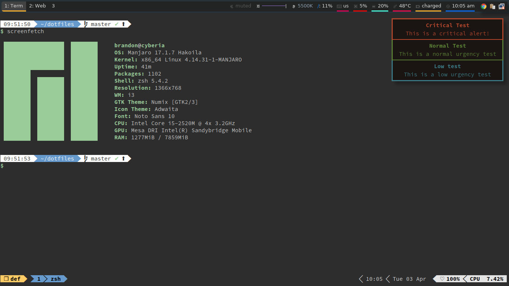

# Dotfiles

Dotfiles for my linux workstation(s). Use the following setup and applications:

+ i3-gaps
+ polybar
+ betterlockscreen
+ urxvt (with pixbuf support)
+ tmux
+ neo-vim
+ firefox
+ google-chrome

